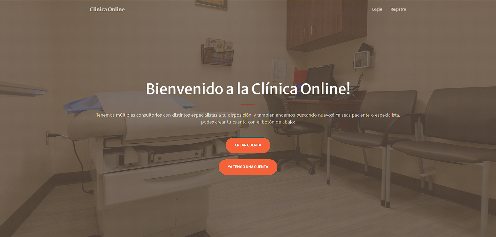
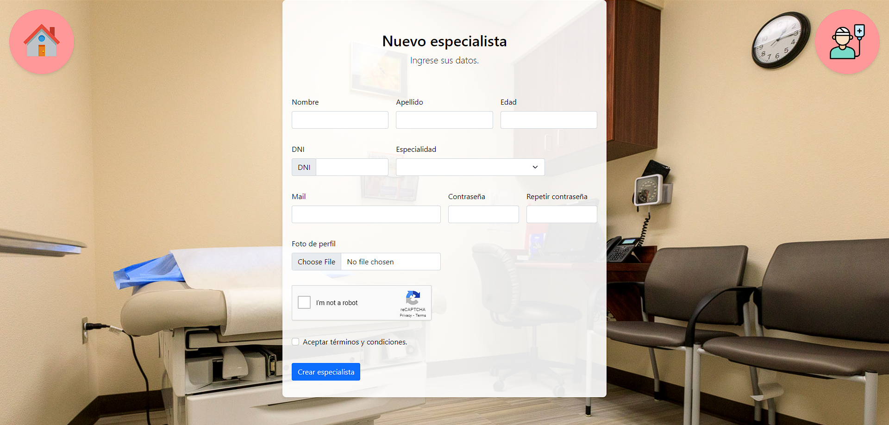

# ClinicaOnline

## Changelog

### 13/6/2024: Primer commit
- Página de bienvenida.
- Registro funcional con fotos para pacientes.

### 13/6/2024: Registro especialistas y login agregados
- Registro especialistas agregado.
- Login agregado.

### 13/6/2024: Login y otras cosas
- Login agregado con botones rápidos.
- Ahora se pueden crear especialidades a la hora de registrar especialistas.
- Botón de home agregado para volver en la parte de registro y login.

[!login](./readme_files/login.png)

### 17/6/2024: Registro y login completos. Sección usuarios comenzada
- Registro pacientes agregado.
- Se pueden agregar imágenes al registro especialistas.
- Múltiples especialidades permitidas.
- Botones de acceso rápido agregados.
- Sección usuarios agregada con lista de pacientes y especialistas.
- Validación por mail para usuarios agregada.

[!usuarios](./readme_files/seccion_usuarios.png)

### 17/6/2024: Registro admin.
- Registro administradores agregado.
- Lista de administradores agregada.

[!admin](./readme_files/registro_admin.png)

### 17/6/2024: Fix frontend /usuarios
- Arreglado frontend de /usuarios.

### 18/6/2024: Sección mi-perfil agregada
- Al acceder con especialista o paciente, el usuario es automáticamente redireccionado a mi-perfil.

### 24/6/2024: Sección mis-horarios agregada
- Sección mis-horarios agregada.
- Especialistas pueden guardar y cargar horarios de acuerdo a especialidad.

[!mis_horarios](./readme_files/mis_horarios.png)

### 26/6/2024: Sección solicitar-turno agregada
- Sección solicitar turno agregada.
- Pacientes pueden pedir turnos.
- Administradores pueden pedir turnos para pacientes.

[!solicitar_turno](./readme_files/solicitar_turno.png)

### 27/6/2024: Sección turnos agregada
- Sección turnos agregada.
- Administradores pueden ver listado de turnos.
- Administradores pueden rechazar turnos.

[!seccion_turnos](./readme_files/seccion_turnos.png)

### 27/6/2024: Sección mis-turnos agregada
- Sección mis-turnos agregada.
- Especialistas y pacientes pueden ver sus turnos.
- Especialistas pueden cambiar estado del turno y agregar reseñas o comentarios.

[!mis_turnos](./readme_files/mis_turnos.png)

### 2/7/2024: Sprint 2 finalizado
- Sprint 2 completamente finalizado.
- Captcha añadido en registro.
- Los pacientes pueden agregar reseñas.

### 3/7/2024: Filtro de turnos y carga de historia clínica
- Los especialistas deben cargar historias clínicas.
- Filtro completo de turnos agregado.
- Animaciones de transición agregadas.

[!historia_clinica](./readme_files/historia_clinica.png)

### 3/7/2024: Readme Fix
- Fix de errores pequeños del readme.

## Descripción del Proyecto
ClinicaOnline es una plataforma que permite la gestión de pacientes y especialistas en una clínica. Proporciona funcionalidades para el registro y login de usuarios, gestión de especialidades, y validación de cuentas por correo electrónico.